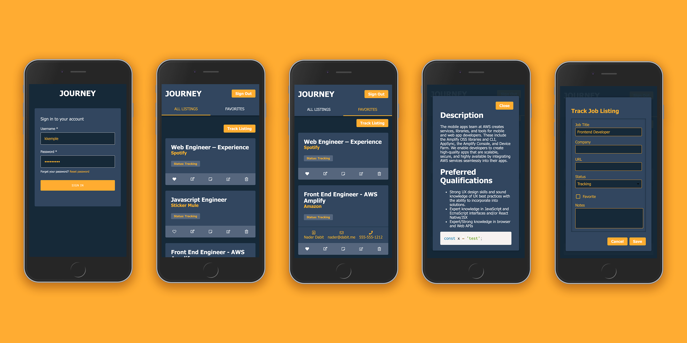

# Journey - The Job Listing Tracker

#### Deploy a full stack web app to help you organize your job search.

🛠 Built with React, GraphQL, AWS Amplify, & AWS AppSync

### Features

- ⚡️ Real-time
- 📝 Keep notes in Markdown
- ❤️ Add favorites
- 👮‍ Authenticated
- 🔥 Serverless back end
- 🚀 GraphQL
- 💻 Deploy back end in minutes



## Deploy the App

The app can be configured to be used by only one person, or allow anyone to sign up and use the app. Make sure to pay attention to the instructions as some things are slightly different for a shared app.

> A shared instance is a great option if you are part of a bootcamp or want to enable others to use this app in their job search.

### Deploy the back end and run the app

1. Clone the repo & install the dependencies

```sh
~ git clone https://github.com/kkemple/journey.git
~ cd journey
~ npm install
```

2. Initialize and deploy the Amplify project

```sh
~ amplify init
? Enter a name for the environment: dev (or whatever you would like to call this env)
? Choose your default editor: <YOUR_EDITOR_OF_CHOICE>
? Do you want to use an AWS profile? Y
~ amplify push
? Are you sure you want to continue? Y
? Do you want to generate code for your newly created GraphQL API? N
> We already have the GraphQL code generated for this project, so generating it here is not necessary.
```

3. Add a user for you to log in with (if you plan to host for multiple users and allow registration, skip this step)

```sh
~ amplify auth console

> choose user pool
```

Under the "Users and Groups" tab, click "Create user". Uncheck the "send an invitation to this new user?" checkbox and enter the necessary attributes, then click "Create user".

4. Start the app and login

```sh
~ yarn start
```

Once the app starts enter the username and password you used in the previous step. You will be prompted to change your password.

### Deploy the front end

1. Create a new repository with your git service of choice

2. Push the project to your new repository

```sh
~ git remote add origin <your_new_repository>
~ git push --set-upstream master
```

3. Connect to [AWS Amplify Console](https://console.aws.amazon.com/amplify/home) and wait for build to start. You will be given a production URL and you are ready to track your job listings!
   > If you wish to allow users to sign up and use this app then pick the `shared` branch to connect in Amplify Console, otherwise use `master`.

---

## Create React App Instructions

This project was bootstrapped with [Create React App](https://github.com/facebook/create-react-app).

## Available Scripts

In the project directory, you can run:

### `npm start`

Runs the app in the development mode.<br>
Open [http://localhost:3000](http://localhost:3000) to view it in the browser.

The page will reload if you make edits.<br>
You will also see any lint errors in the console.

### `npm test`

Launches the test runner in the interactive watch mode.<br>
See the section about [running tests](https://facebook.github.io/create-react-app/docs/running-tests) for more information.

### `npm run build`

Builds the app for production to the `build` folder.<br>
It correctly bundles React in production mode and optimizes the build for the best performance.

The build is minified and the filenames include the hashes.<br>
Your app is ready to be deployed!

See the section about [deployment](https://facebook.github.io/create-react-app/docs/deployment) for more information.

### `npm run eject`

**Note: this is a one-way operation. Once you `eject`, you can’t go back!**

If you aren’t satisfied with the build tool and configuration choices, you can `eject` at any time. This command will remove the single build dependency from your project.

Instead, it will copy all the configuration files and the transitive dependencies (Webpack, Babel, ESLint, etc) right into your project so you have full control over them. All of the commands except `eject` will still work, but they will point to the copied scripts so you can tweak them. At this point you’re on your own.

You don’t have to ever use `eject`. The curated feature set is suitable for small and middle deployments, and you shouldn’t feel obligated to use this feature. However we understand that this tool wouldn’t be useful if you couldn’t customize it when you are ready for it.

## Learn More

You can learn more in the [Create React App documentation](https://facebook.github.io/create-react-app/docs/getting-started).

To learn React, check out the [React documentation](https://reactjs.org/).

### Code Splitting

This section has moved here: https://facebook.github.io/create-react-app/docs/code-splitting

### Analyzing the Bundle Size

This section has moved here: https://facebook.github.io/create-react-app/docs/analyzing-the-bundle-size

### Making a Progressive Web App

This section has moved here: https://facebook.github.io/create-react-app/docs/making-a-progressive-web-app

### Advanced Configuration

This section has moved here: https://facebook.github.io/create-react-app/docs/advanced-configuration

### Deployment

This section has moved here: https://facebook.github.io/create-react-app/docs/deployment

### `npm run build` fails to minify

This section has moved here: https://facebook.github.io/create-react-app/docs/troubleshooting#npm-run-build-fails-to-minify
